# EXNO-5-DS-DATA VISUALIZATION USING MATPLOT LIBRARY

# Aim:
  To Perform Data Visualization using matplot python library for the given datas.

# EXPLANATION:
Data visualization is the graphical representation of information and data. By using visual elements like charts, graphs, and maps, data visualization tools provide an accessible way to see and understand trends, outliers, and patterns in data.

# Algorithm:
STEP 1:Include the necessary Library.

STEP 2:Read the given Data.

STEP 3:Apply data visualization techniques to identify the patterns of the data.

STEP 4:Apply the various data visualization tools wherever necessary.

STEP 5:Include Necessary parameters in each functions.

# Coding and Output:

## Data Visualization using Matplotlib

### Line Graph


```python
import pandas as pd
import numpy as np
import seaborn as sns
import matplotlib.pyplot as plt
```

```python
x = [1, 2, 3, 4, 5]
y = [3, 6, 2, 7, 1]
```

```python
# CREATE A LINE GRAPH FOR X AND Y AND LABEL X axis and Y Axis and create a legend
plt.plot(x, y, label="Scale\nX -->1 unit\nY -->1 unit", linestyle="--", marker="o", c="black", mfc="blue")
plt.xlabel("X Axis")
plt.ylabel("Y Axis")
plt.title("Simple Line Graph")
plt.grid(True)
plt.legend()
plt.show() 
```
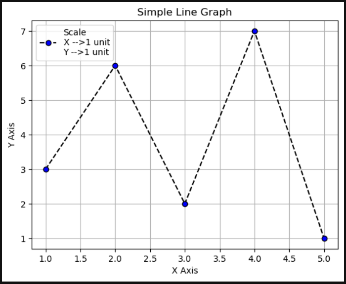  

```python
# line 1 points
x1 = [1,2,3]
y1 = [2,4,1]
x2 = [1,2,3]
y2 = [4,1,3]
```

```python
# plot line 1 and line 2 points in same graph and include the necessary parameters
plt.plot(x1, y1, label="Line 1", linestyle="--", marker="o", c="red", mfc="cyan")
plt.plot(x2, y2, label="Line 2", linestyle="--", marker="o", c="blue", mfc="brown")
plt.xlabel("X Axis")
plt.ylabel("Y Axis")
plt.title("Line graph featuring two lines")
plt.grid(True)
plt.legend()
plt.show() 
```
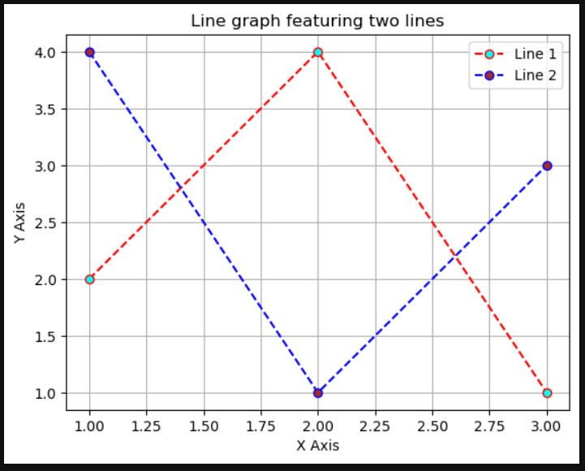  

```python
# Creating some random data
x = [1, 2, 3, 4, 5]
y1 = [10, 12, 14, 16, 18]
y2 = [5, 7, 9, 11, 13]
y3 = [2, 4, 6, 8, 10]
```

```python
plt.plot(x, y1, label="Line-1", c="red", ls="-", lw="1", marker="s", mfc="cyan")
plt.plot(x, y2, label="Line-2", c="green", ls="--", lw="2", marker="o", mfc="magenta")
plt.plot(x, y3, label="Line-3", c="blue", ls=":", lw="2", marker="d", mfc="orange")
plt.title("Multi-Line Plot")
plt.legend() 
plt.show()
```
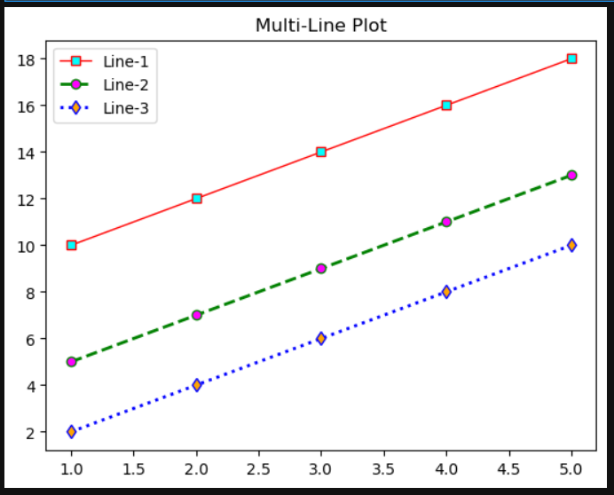  

```python
x_values = [0,1,2,3,4,5]
y_values = [0,1,4,9,16,25]
```

```python
# implement line graph using fill between option
plt.plot(x_values, y_values, color="blue", label="Y=X²")
plt.fill_between(x_values, y_values, color="skyblue", alpha=0.5, label="Area")
plt.xlabel("X Axis")
plt.ylabel("Y Axis")
plt.legend()
plt.show()
```
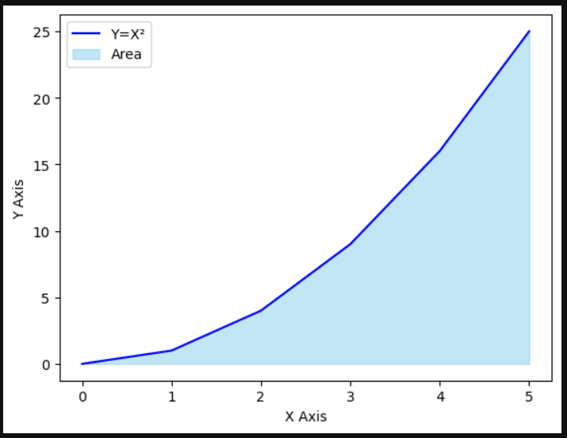  

```python
from scipy.interpolate import make_interp_spline
x = np.array([1, 2, 3, 4, 5, 6, 7, 8, 9, 10])
y = np.array([2, 4, 5, 7, 8, 8, 9, 10, 11, 12])
```

```python
# interpolate data using cubic spline
spline=make_interp_spline(x,y)
x_new=np.linspace(min(x),max(x),500)
y_new=spline(x_new)
plt.scatter(x,y,label="Original Data", color="red")
plt.plot(x_new, y_new, label="Interpolated Data", color="Blue")
plt.xlabel("X Axis")
plt.ylabel("Y Axis")
plt.title("Cubic Spline Interpolation")
plt.legend()
plt.show()
```
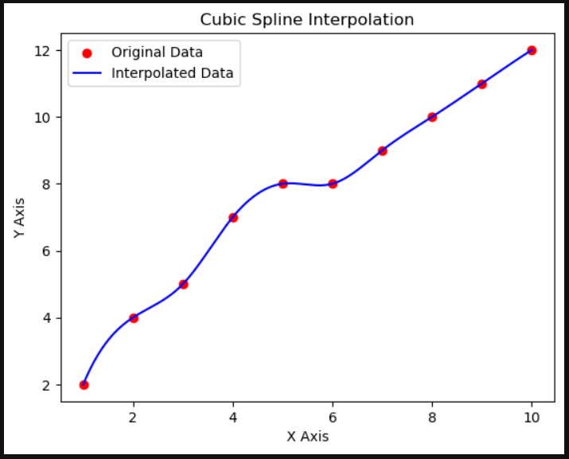  

### Bar Graph

```python
values = [5, 6, 3, 7, 2]
names  = ["A", "B", "C", "D", "E"]
```

```python
# Create bar graph using the above two variables and include the necessary parameters

c1 =['red', 'green']
c2 =['b', 'g'] # we can use this for color
# plot a bar chart
plt.bar(names, values, color=c1)
plt.xlabel("Names")
plt.ylabel("Values")
plt.show()
```
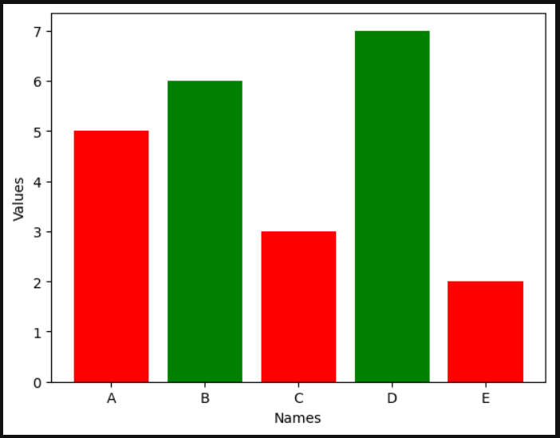  

```python
df = sns.load_dataset("tips")
avg_total_bill = df.groupby('day', observed=False)['total_bill'].mean()
avg_tip = df.groupby('day', observed=False)['tip'].mean()
```

```python
df
```
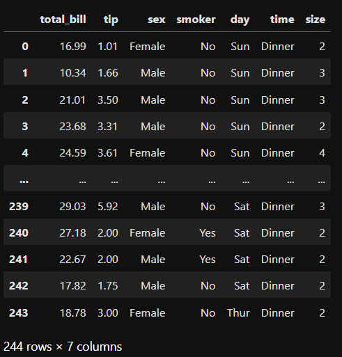  

```python
plt.figure(figsize=(8, 6))
p1 = plt.bar(avg_total_bill.index, avg_total_bill, label='Total Bill')
p2 = plt.bar(avg_tip.index, avg_tip, bottom=avg_total_bill, label='Tip')
# Set the labels and title
plt.xlabel('Day of the Week')
plt.ylabel('Amount')
plt.title('Average Total Bill and Tip by Day')
plt.legend()
plt.show()
```
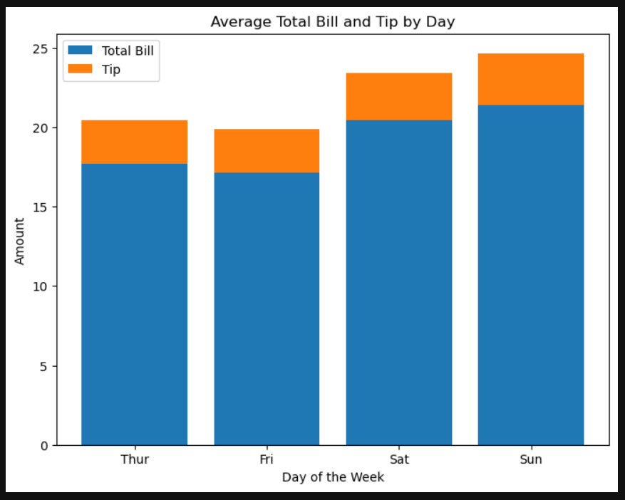  

### Scatter Plot

```python
x_values = [0,1,2,3,4,5]
y_values = [0,1,4,9,16,25]
```

```python
# CREATE A SCATTER PLOT FOR X_VALUES AND Y_VALUES
plt.scatter(x_values, y_values, color="red")
plt.xlabel("X Axis")
plt.ylabel("Y Axis")
plt.title("Scatter Plot")
plt.show()
```
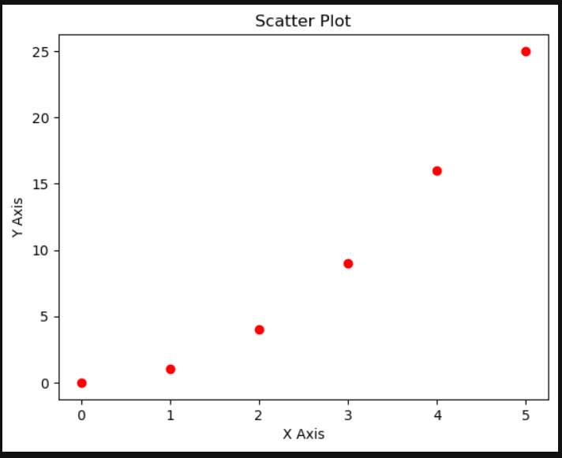  

```python
# x-axis values
x = [1,2,3,4,5,6,7,8,9,10]
# y-axis values
y = [2,4,5,7,6,8,9,11,12,12]
```

```python
# plot the above points x and y in scatter plot Using the parmeters label= "stars", color="green", marker="*", s=30
plt.scatter(x,y,label="Stars",color="green",marker="*",s=30)
plt.xlabel("X Axis")
plt.ylabel("Y Axis")
plt.title("Stars - Scatter Plot")
plt.legend()
plt.show()
```
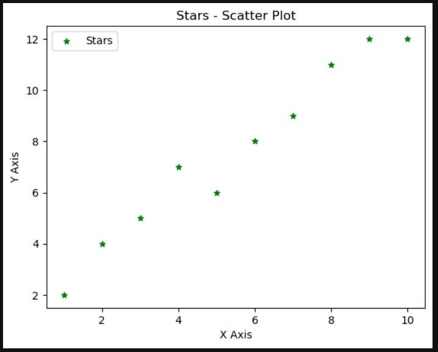  

### Pie Chart

```python
# defining labels
activities = ['eat', 'sleep', 'work', 'play']
# portion covered by each label
slices = [3, 7, 8, 6]
# color for each label
colors = ['r', 'y', 'g', 'b']
```

```python
# plot the pie chart using above parameters
plt.pie(slices, labels=activities, colors=colors, startangle=90, shadow=True, explode=[0,0.03,0,0])
plt.show()
```
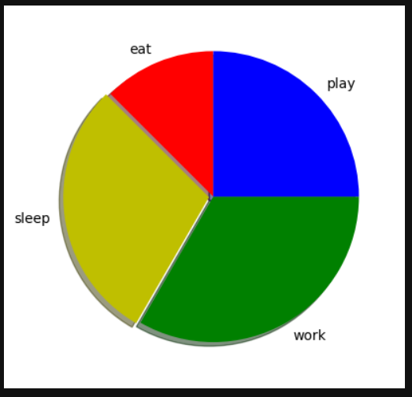  

# Result:
Thus the program to Perform Data Visualization using matplot python library for the given data has been implemented.
